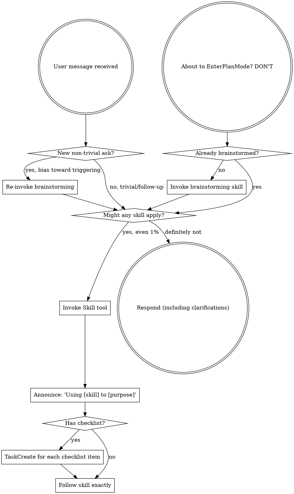
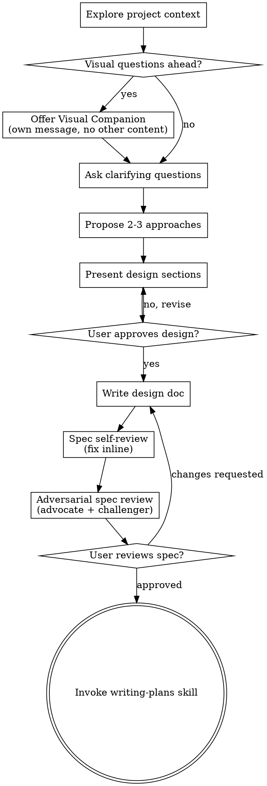

# Workflow Customization Implementation Plan

> **For agentic workers:** REQUIRED SUB-SKILL: Use superpowers-extended-cc:subagent-driven-development to implement this plan task-by-task. Steps use checkbox (`- [ ]`) syntax for tracking.

**Goal:** Customize the superpowers fork to enforce an opinionated development workflow with adversarial review gates, mandatory TDD, auto-selected subagent-driven development, and mandatory code review.

**Architecture:** In-place modifications to existing skill files. No new skills created. File deletions for CI/deployment artifacts.

**Tech Stack:** Markdown (skill files), Git, Claude Code plugin system

**Note:** All tasks are skill file edits (markdown). TDD is not applicable per the spec's scoping to code-producing tasks only.

---

### Task 1: Delete CI/deployment artifacts

**Goal:** Remove GHA templates, deployment scripts, and contribution infrastructure that don't apply to this personal fork.

**Files:**
- Delete: `.github/ISSUE_TEMPLATE/bug_report.md`
- Delete: `.github/ISSUE_TEMPLATE/config.yml`
- Delete: `.github/ISSUE_TEMPLATE/feature_request.md`
- Delete: `.github/ISSUE_TEMPLATE/platform_support.md`
- Delete: `.github/PULL_REQUEST_TEMPLATE.md`
- Delete: `.github/FUNDING.yml`
- Delete: `scripts/bump-version.sh`

**Acceptance Criteria:**
- [ ] `.github/` directory no longer exists
- [ ] `scripts/bump-version.sh` no longer exists
- [ ] `scripts/` directory is removed if empty after deletion

**Verify:** `ls .github/ 2>&1` -> "No such file or directory" AND `ls scripts/bump-version.sh 2>&1` -> "No such file or directory"

**Steps:**

- [ ] **Step 1: Delete the .github directory**

```bash
rm -rf .github/
```

- [ ] **Step 2: Delete bump-version.sh and scripts/ if empty**

```bash
rm scripts/bump-version.sh
rmdir scripts/ 2>/dev/null || true
```

- [ ] **Step 3: Verify deletions**

Run: `ls .github/ 2>&1 && ls scripts/bump-version.sh 2>&1`
Expected: Both report "No such file or directory"

- [ ] **Step 4: Commit**

```bash
git add -A .github/ scripts/
git commit -m "chore: NO_JIRA remove CI templates and deployment scripts from fork"
```

---

### Task 2: Add brainstorming re-trigger to using-superpowers

**Goal:** Modify `skills/using-superpowers/SKILL.md` to add mid-conversation brainstorming re-trigger logic with bias toward triggering.

**Files:**
- Modify: `skills/using-superpowers/SKILL.md`

**Acceptance Criteria:**
- [ ] New "Mid-Conversation Re-trigger" section exists after "The Rule" section
- [ ] Flow diagram updated with re-trigger decision node
- [ ] Red flags table includes re-trigger rationalization patterns
- [ ] Skip cases list includes small self-evident code changes

**Verify:** `grep -c "Mid-Conversation Re-trigger" skills/using-superpowers/SKILL.md` -> "1"

**Steps:**

- [ ] **Step 1: Add Mid-Conversation Re-trigger section after The Rule section**

Insert the following after the line `**Invoke relevant or requested skills BEFORE any response or action.**...` paragraph and before the flow diagram:

```markdown
## Mid-Conversation Re-trigger

When a new user message arrives mid-conversation, evaluate whether brainstorming should be re-invoked:

1. Has a brainstorming cycle already completed for THIS SPECIFIC ask? If yes, skip.
2. Is this a new ask (not a follow-up to the current in-progress task)? If yes, evaluate.
3. Judgment call with bias toward triggering: Would this ask benefit from exploring requirements, approaches, or trade-offs? If even slightly yes, invoke brainstorming.

**Red flags that SHOULD trigger brainstorming:**
- "Can you also add..." (new feature on top of existing work)
- "Actually, let's change..." (pivot in direction)
- "New thing -" / "Next task -" (explicit new scope)
- Any ask that introduces new behavior, new files, or new integration points

**Cases where it's fine to skip:**
- "Fix this typo"
- "Rename X to Y"
- "Run the tests"
- Small, self-evident code changes (add a log line, update a constant)
- Direct follow-up questions about in-progress work

**Default: trigger.** If you're unsure, brainstorm. The cost of an unnecessary brainstorm is minutes. The cost of skipping one is building the wrong thing.
```

- [ ] **Step 2: Update the flow diagram**

Replace the existing flow diagram with this updated version that adds the re-trigger decision node:



- [ ] **Step 3: Add re-trigger rationalization patterns to Red Flags table**

Add these rows to the existing Red Flags table:

| "We already brainstormed this session" | Each new ask gets its own evaluation. Session !== scope. |
| "This is a follow-up" | Follow-ups to the same task are fine. New features are not follow-ups. |
| "The user said 'also'" | "Also" means new scope. Brainstorm it. |

- [ ] **Step 4: Commit**

```bash
git add skills/using-superpowers/SKILL.md
git commit -m "feat: NO_JIRA add mid-conversation brainstorming re-trigger logic"
```

---

### Task 3: Add adversarial spec review gate to brainstorming

**Goal:** Insert adversarial dual-subagent review step (7.5) into `skills/brainstorming/SKILL.md` between spec self-review and user review.

**Files:**
- Modify: `skills/brainstorming/SKILL.md`

**Acceptance Criteria:**
- [ ] Checklist has 10 items (was 9), with new item 8 "Adversarial spec review"
- [ ] New "Adversarial Spec Review" section exists with full advocate/challenger instructions
- [ ] Flow diagram updated with "Adversarial spec review" node between self-review and user review
- [ ] Reconciliation logic has 4 clear branches

**Verify:** `grep -c "Adversarial Spec Review" skills/brainstorming/SKILL.md` -> at least "1"

**Steps:**

- [ ] **Step 1: Update the checklist**

Replace the existing checklist (lines 26-34) with:

```markdown
1. **Explore project context** - check files, docs, recent commits
2. **Offer visual companion** (if topic will involve visual questions) - this is its own message, not combined with a clarifying question. See the Visual Companion section below.
3. **Ask clarifying questions** - one at a time, understand purpose/constraints/success criteria
4. **Propose 2-3 approaches** - with trade-offs and your recommendation
5. **Present design** - in sections scaled to their complexity, get user approval after each section
6. **Write design doc** - save to `docs/superpowers/specs/YYYY-MM-DD-<topic>-design.md` and commit
7. **Spec self-review** - quick inline check for placeholders, contradictions, ambiguity, scope (see below)
8. **Adversarial spec review** - dispatch two opus subagents (advocate + challenger), reconcile findings, fix spec (see below)
9. **User reviews written spec** - ask user to review the spec file before proceeding
10. **Transition to implementation** - invoke writing-plans skill to create implementation plan
```

- [ ] **Step 2: Update the flow diagram**

Replace the existing flow diagram with this version that adds the adversarial review node:



- [ ] **Step 3: Add the Adversarial Spec Review section**

Insert the following new section after the "Spec Self-Review" section and before the "User Review Gate" section:

```markdown
## Adversarial Spec Review

After self-review, dispatch two opus subagents in parallel to adversarially review the spec. Fix issues autonomously. Only escalate true unknowns to the user.

**Dispatch two opus subagents in parallel:**

1. **Advocate subagent:** Argues the spec is solid. Identifies strengths, validates completeness, confirms feasibility. Must genuinely defend the design, not rubber-stamp. Prompt must include:
   - The full spec document content
   - "You are the ADVOCATE. A CHALLENGER is reviewing this same spec. You will not see their output."
   - "Provide: Strengths, Acknowledged Risks, Defense of Design Choices"
   - "Keep under 500 words. Focus on substance."

2. **Challenger subagent:** Argues against the spec. Finds gaps, ambiguities, missing edge cases, flawed assumptions, better alternatives. Must genuinely attack, not nitpick formatting. Prompt must include:
   - The full spec document content
   - "You are the CHALLENGER. An ADVOCATE is reviewing this same spec. You will not see their output."
   - "Provide: Gaps, Ambiguities, Flawed Assumptions, Better Alternatives, Daily-Use Friction Risks"
   - "Keep under 500 words. Focus on top 5-7 most impactful issues."

**Both subagents MUST use model: opus.**

**Reconciliation (orchestrator does this, not a subagent):**

| Situation | Action |
|-----------|--------|
| Challenger raises point advocate also flagged as risk | High-confidence issue. Fix it. |
| Challenger raises point advocate explicitly defended | Evaluate both arguments. Pick the stronger one. |
| Both agree on a point | No action needed. |
| Neither can resolve, depends on user intent/domain knowledge | Surface to user. |

After reconciliation, implement fixes directly into the spec document. Then proceed to user review.
```

- [ ] **Step 4: Commit**

```bash
git add skills/brainstorming/SKILL.md
git commit -m "feat: NO_JIRA add adversarial spec review gate with advocate/challenger pattern"
```

---

### Task 4: Modify writing-plans for adversarial review, TDD enforcement, and auto-select

**Goal:** Three changes to `skills/writing-plans/SKILL.md`: add adversarial plan review gate, enforce TDD in task structure, and auto-select subagent-driven-development.

**Files:**
- Modify: `skills/writing-plans/SKILL.md`

**Acceptance Criteria:**
- [ ] Adversarial Plan Review section exists after Self-Review section
- [ ] TDD enforcement language added to Task Granularity and Task Structure sections
- [ ] Self-Review checklist includes TDD ordering check
- [ ] AskUserQuestion block is replaced with direct subagent-driven-development invocation
- [ ] HARD-GATE updated to mandate subagent-driven-development

**Verify:** `grep -c "Adversarial Plan Review" skills/writing-plans/SKILL.md` -> "1" AND `grep -c "AskUserQuestion" skills/writing-plans/SKILL.md` -> "0"

**Steps:**

- [ ] **Step 1: Add TDD enforcement to Task Granularity section**

After the line "Key principle: TDD cycles happen WITHIN tasks..." (line 60), add:

```markdown

**TDD mandate:** All tasks that produce application or production code MUST specify tests-first ordering. The "Steps" section of every code-producing task begins with "Write the failing test" before any implementation. Skill file edits, configuration changes, and documentation are excluded from this requirement.
```

- [ ] **Step 2: Add TDD check to Self-Review section**

After item 3 ("Type consistency...") in the Self-Review section (line 162), add:

```markdown

**4. TDD ordering:** Does every task that produces code have tests written before implementation in its Steps section? If any task has implementation before tests, reorder the steps.
```

- [ ] **Step 3: Add Adversarial Plan Review section**

Insert the following new section after the Self-Review section and before the Execution Handoff section:

```markdown
## Adversarial Plan Review

After self-review, dispatch two opus subagents in parallel to adversarially review the plan. Same pattern as the brainstorming spec review.

**Dispatch two opus subagents in parallel:**

1. **Advocate subagent:** Argues the plan is ready to execute. Validates task ordering, granularity, completeness against the spec, TDD structure, and that each task is independently verifiable. Prompt must include:
   - The full plan document content
   - The spec document path (so advocate can reference it)
   - "You are the ADVOCATE. A CHALLENGER is reviewing this same plan."
   - "Keep under 500 words."

2. **Challenger subagent:** Argues the plan has problems. Looks for missing steps, incorrect ordering, tasks too large or too small, implicit dependencies not captured, gaps in test coverage strategy, assumptions about the codebase that haven't been verified. Prompt must include:
   - The full plan document content
   - The spec document path
   - "You are the CHALLENGER. An ADVOCATE is reviewing this same plan."
   - "Keep under 500 words. Focus on top 5-7 most impactful issues."

**Both subagents MUST use model: opus.**

**Reconciliation:** Same rules as the brainstorming adversarial spec review:

| Situation | Action |
|-----------|--------|
| Challenger raises point advocate also flagged as risk | High-confidence issue. Fix it. |
| Challenger raises point advocate explicitly defended | Evaluate both arguments. Pick the stronger one. |
| Both agree on a point | No action needed. |
| Neither can resolve, depends on user intent/domain knowledge | Surface to user. |

After reconciliation, update the plan document in-place with fixes. Then proceed to execution.
```

- [ ] **Step 4: Replace Execution Handoff with auto-select subagent-driven**

Replace the entire "Execution Handoff" section (from the first HARD-GATE through the second HARD-GATE) with:

```markdown
## Execution Handoff

<HARD-GATE>
STOP. You are about to complete the plan. DO NOT call EnterPlanMode or ExitPlanMode. Both are FORBIDDEN.

You MUST invoke `superpowers-extended-cc:subagent-driven-development` directly. No user choice. No AskUserQuestion. Subagent-driven development is always the execution method.
</HARD-GATE>

**Announce:** "Plan complete and saved to `docs/superpowers/plans/<filename>.md`. Proceeding with subagent-driven development."

Invoke the Skill tool: `superpowers-extended-cc:subagent-driven-development`
- The skill handles everything: subagent dispatch, review, task tracking
- You stay in this session as the coordinator
- Do NOT start working on tasks directly
```

- [ ] **Step 5: Update plan header template**

Replace the plan header template's agentic worker note (line 74) with:

```markdown
> **For agentic workers:** REQUIRED SUB-SKILL: Use superpowers-extended-cc:subagent-driven-development to implement this plan task-by-task. Steps use checkbox (`- [ ]`) syntax for tracking.
```

- [ ] **Step 6: Commit**

```bash
git add skills/writing-plans/SKILL.md
git commit -m "feat: NO_JIRA add adversarial plan review, enforce TDD, auto-select subagent-driven"
```

---

### Task 5: Reinforce mandatory code review, finishing branch, and opus-only in subagent-driven-development

**Goal:** Modify `skills/subagent-driven-development/SKILL.md` to add explicit mandatory language for code review and finishing-a-development-branch, override model selection to always use opus, and add WIP push escape hatch.

**Files:**
- Modify: `skills/subagent-driven-development/SKILL.md`

**Acceptance Criteria:**
- [ ] Model Selection section replaced with opus-only policy
- [ ] "Mandatory Code Review" callout added before Red Flags section
- [ ] "Mandatory Finishing Branch" callout added
- [ ] WIP push escape hatch documented
- [ ] No references to cheap/standard/capable model tiers remain

**Verify:** `grep -c "cheap" skills/subagent-driven-development/SKILL.md` -> "0" AND `grep -c "Mandatory Code Review" skills/subagent-driven-development/SKILL.md` -> "1"

**Steps:**

- [ ] **Step 1: Replace Model Selection section**

Replace the entire "Model Selection" section (lines 96-107) with:

```markdown
## Model Policy

All subagents use opus. No exceptions. This applies to:
- Implementation subagents
- Spec compliance reviewer subagents
- Code quality reviewer subagents
- Final code reviewer subagent

When dispatching any subagent via the Agent tool, always pass `model: "opus"`.
```

- [ ] **Step 2: Add Mandatory Code Review section before Red Flags**

Insert before the "Red Flags" section:

```markdown
## Mandatory Code Review

Code review is mandatory. Never skip the final code review round regardless of task count or perceived simplicity.

After the final code review, ALL findings must be addressed before proceeding. No "minor, will fix later." No deferring issues. Every finding gets resolved or explicitly justified.

<HARD-GATE>
You MUST NOT invoke finishing-a-development-branch until the final code review is complete and all findings are addressed.
</HARD-GATE>

## Mandatory Finishing Branch

You MUST invoke `superpowers-extended-cc:finishing-a-development-branch` before any git push or PR creation. No shortcutting directly to `gh pr create` or `git push`.

**WIP push escape hatch:** When the user explicitly requests a WIP push for backup or collaboration, allow it without requiring finishing-a-development-branch. The mandate applies to completed work, not in-progress backups.
```

- [ ] **Step 3: Commit**

```bash
git add skills/subagent-driven-development/SKILL.md
git commit -m "feat: NO_JIRA enforce opus-only, mandatory code review, mandatory finishing branch"
```

---

### Task 6: Plugin swap

**Goal:** Push changes to the fork, create and merge PR, then swap the installed plugin.

**Files:**
- No file modifications. Git and plugin management operations.

**Acceptance Criteria:**
- [ ] All changes pushed to a branch on chrisbobrowitz/superpowers
- [ ] PR created and merged against main
- [ ] Marketplace source updated to point to fork
- [ ] Plugin updated from new marketplace source
- [ ] All skills listed correctly after installation

**Verify:** `claude plugin list` shows superpowers installed and enabled

**Steps:**

- [ ] **Step 1: Create feature branch and push**

```bash
git checkout -b feat/workflow-customization
git push -u origin feat/workflow-customization
```

- [ ] **Step 2: Create PR**

```bash
gh pr create --title "feat: customize workflow for personal fork" --body "$(cat <<'EOF'
## Summary
- Strip CI/deployment artifacts (.github/, scripts/bump-version.sh)
- Add mid-conversation brainstorming re-trigger with bias toward triggering
- Add adversarial spec review gate (advocate + challenger opus subagents)
- Add adversarial plan review gate (same pattern)
- Enforce TDD for all code-producing tasks
- Auto-select subagent-driven development (remove user choice)
- Reinforce mandatory code review and finishing-a-development-branch
- Override model selection to opus-only for all subagents

## Test plan
- [ ] Verify all modified skill files have valid markdown structure
- [ ] Start new Claude Code session with updated plugin and confirm skills load
- [ ] Run a brainstorming session to verify adversarial review triggers
EOF
)"
```

- [ ] **Step 3: Merge PR**

```bash
gh pr merge --squash
```

- [ ] **Step 4: Update marketplace source to point to fork**

The current marketplace `superpowers-extended-cc-marketplace` points to `pcvelz/superpowers`. Update it to point to the fork:

```bash
claude plugin marketplace remove superpowers-extended-cc-marketplace
claude plugin marketplace add github:chrisbobrowitz/superpowers
```

Note: if the marketplace name changes after re-adding, update the plugin reference accordingly.

- [ ] **Step 5: Reinstall plugin from updated marketplace**

```bash
claude plugin uninstall superpowers-extended-cc@superpowers-extended-cc-marketplace
```

Then install from the new marketplace (name may vary based on step 4 output):

```bash
claude plugin install superpowers-extended-cc@<new-marketplace-name>
```

- [ ] **Step 6: Verify**

```bash
claude plugin list
```

Confirm superpowers-extended-cc is installed and enabled.

**Rollback:** If the fork install fails, re-add the original marketplace and reinstall:
```bash
claude plugin marketplace add github:pcvelz/superpowers
claude plugin install superpowers-extended-cc@superpowers-extended-cc-marketplace
```
